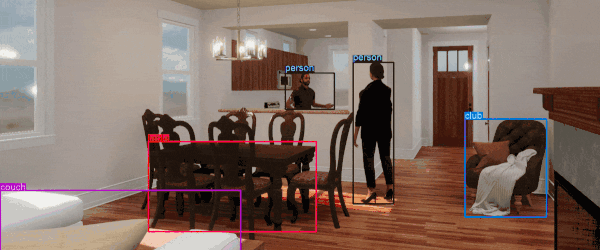

<p align="center">
  
</p>

<h1 align="center">
Unity Computer Vision Dataset Visualizer
</h1>

Unity Computer Vision team's python-based Dataset Visualizer provides an easy way to quickly visualize annotations from synthetic data generated using Unity's [Perception Package](https://github.com/Unity-Technologies/com.unity.perception). Even for large datasets, selectively sample frames and visualize 2D Bounding Boxes, 3D Bounding Boxes, Keypoints, Semantic Segmentation, and Instance Segmentation data for each frame. Dive into the capture and metric JSON data to see in-depth information on each frame!

<div align="center">
  
</div>

## Requirements

* Windows 10 or OSX
* Chrome, Firefox, or Safari 14 and newer (Older versions of Safari are not supported)
* Python 3.7 or 3.8. **Note that this application is not compatible with Python 3.9.**

## Installation

We recommend using a virtual environment to install and run the app. One way to achieve this is using Conda.

**Step 1:** Create a virtual environment (skip to step 2 if you are setting up a virtual environment using other methods)

* Install Conda if you do not already have it installed on your computer. We recommend [Miniconda](https://docs.conda.io/en/latest/miniconda.html).

* Once Conda is installed: 
  * On Mac OS, open a new terminal window.
  * On Windows, you will need to open either Anaconda Prompt or Anaconda Powershell Prompt. These can be found in the Start menu.

* Create a virtual environment named `dv_env` using Conda, and activate it (use `3.7` or `3.8` for `<python_version>`):

```bash
conda create -n dv_env python=<python_version>
conda activate dv_env
```
**Step 2:** Install application

Use the following command to install the visualizer.

```bash
pip install unity-cv-datasetvisualizer
```

> :information_source: On Windows, if you get an error about the system not being able to create a process when running the install command, make sure you have the latest version of Conda installed. Then create a new environment with a new name, and try the install command again. If the error persists, try leaving the Conda virtual environment using `conda deactivate` and running the command outside of any virtual environment. 

> :information_source: If you receive an error saying the unity-dataset-visualizer' distribution was not found, try closing your command line window, opening it again and activating the `dv_env` environment, and running the `datasetvisualizer` command again.

## Running the visualizer

To view helpful information in your terminal on how to use the dataset visualizer, simply run the following command: 
`datasetvisualizer`

```bash
usage: datasetvisualizer [-h] [-d DATA] [-s]

Visualize annotations of synthetic datasets generated using Unity's Perception package.

optional arguments:
  -h, --help            show this help message and exit
  -d DATA, --data DATA  Path to root of dataset
  -s, --skip-dataset    Run visualizer without selecting a dataset through the CLI
```

To open the dataset visualizer (without specifying a path to a dataset), utilize the following command:

```bash
datasetvisualizer -s
        OR
datasetvisualizer --skip-dataset
```

To open a dataset at a particular path right from your terminal, use the command:

```bash
datasetvisualizer -d "<path_to_dataset>"
        OR
datasetvisualizer --data "<path_to_dataset>"
```

This command may take a few seconds to execute. Once it is done, your browser will automatically open to `http://localhost:8501/` (or if port is taken, 8502, 8503, etc.) and display the application. If that does not happen, open a new browser tab and manually navigate to that address.

Once in the application, you will be prompted to select a dataset folder. Click ***Change Dataset*** at the left side of the screen and then select the root folder of your Unity Computer Vision dataset.

## Known issues

* The tool cannot open a dataset that has no labeler data (bounding boxes, semantic segmentation, etc.)
* On Windows: a warning appears when launching the app (This can be ignored)
* 3D bounding boxes are not rendered properly when the camera is inside the box.
